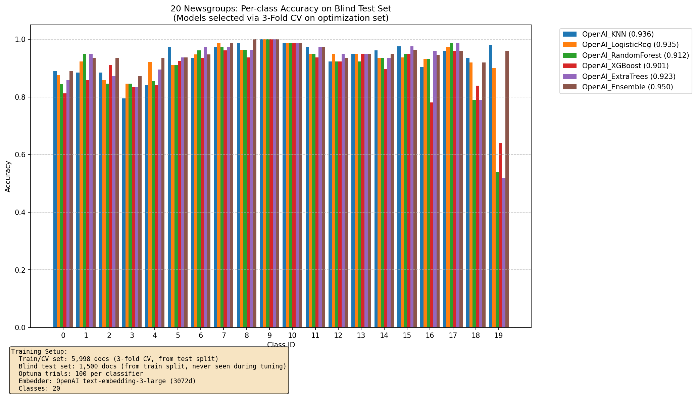

# 20 Newsgroups Text Classification

Text classification on the [20 Newsgroups](http://qwone.com/~jason/20Newsgroups/) dataset using OpenAI embeddings with Optuna hyperparameter optimization.

Achieves **~85% accuracy** on 20-class classification using an ensemble of optimized classifiers.



## Features

- OpenAI `text-embedding-3-large` embeddings (3072 dimensions)
- Optuna-based hyperparameter optimization with 3-fold cross-validation
- Multiple classifiers: KNN, Logistic Regression, Random Forest, XGBoost, ExtraTrees
- Weighted soft-voting ensemble with optimized weights
- Embedding caching to avoid redundant API calls

## Requirements

- Python 3.12+
- [uv](https://github.com/astral-sh/uv) package manager
- OpenAI API key
- (macOS) `libomp` for XGBoost multi-core support

## Installation

```bash
# Clone the repository
git clone <repo-url>
cd newsGroups_20_classification

# Install dependencies
uv sync

# macOS only: install libomp for XGBoost
brew install libomp
```

## Configuration

Set your OpenAI API key:

```bash
export OPENAI_API_KEY="your-key-here"
```

Or create a `.env` file:

```
OPENAI_API_KEY=your-key-here
```

## Usage

### Quick Test (Dry Run)

```bash
uv run python src/evaluate_models.py --dry_run --cache cache/data.npz
```

Uses minimal data (60 train, 30 test docs) and 1 Optuna trial per classifier.

### Full Evaluation

```bash
uv run python src/evaluate_models.py --n_trials 100 --cache cache/data.npz
```

### Command Line Options

| Flag | Default | Description |
|------|---------|-------------|
| `--cache` | None | Path to NPZ cache file for embeddings |
| `--dry_run` | False | Quick test with minimal data |
| `--n_trials` | 20 | Number of Optuna trials per classifier |
| `--batch_size` | 32 | Batch size for OpenAI API calls |

## Project Structure

```
.
├── src/
│   ├── evaluate_models.py      # Main script: training, optimization, evaluation
│   ├── dataloader.py           # 20 Newsgroups data loading and preprocessing
│   └── embeddings/
│       ├── base_embedder.py    # Abstract base class for embedders
│       └── openai_embedder.py  # OpenAI embedding implementation
├── models/                     # Trained models (.joblib) and ensemble weights
├── cache/                      # Embedding cache (.npz)
├── pyproject.toml              # Dependencies
└── README.md
```

## How It Works

### Data Split Strategy

```
20 Newsgroups Dataset
├── Test Split (7,498 docs) → Train/CV set (3-fold CV for hyperparameter tuning)
└── Train Split (11,261 docs) → Sample 1,000 docs as Blind Test Set
```

The blind test set is never seen during Optuna optimization—it's reserved for final unbiased evaluation.

### Pipeline

1. **Load data** from scikit-learn's 20 Newsgroups dataset
2. **Embed documents** using OpenAI `text-embedding-3-large`
3. **Optimize hyperparameters** for each classifier via Optuna with 3-fold CV
4. **Train final models** with best hyperparameters on full train/CV set
5. **Evaluate** on blind test set and generate comparison plot

### Classifiers

| Classifier | Description |
|------------|-------------|
| KNN | K-Nearest Neighbors with cosine distance |
| LogisticReg | Logistic Regression with L2 regularization |
| RandomForest | Random Forest ensemble |
| XGBoost | Gradient Boosting |
| ExtraTrees | Extremely Randomized Trees |
| Ensemble | Soft voting with Optuna-optimized weights |

## Caching

Embeddings are cached to a single `.npz` file:

```
cache/data.npz
├── index_x      # Train/CV texts
├── index_y      # Train/CV labels
├── query_x      # Blind test texts
├── query_y      # Blind test labels
├── OpenAI_index # Train/CV embeddings (n × 3072)
└── OpenAI_query # Blind test embeddings (n × 3072)
```

- **First run**: Computes embeddings via OpenAI API (~$2-3 for full dataset)
- **Subsequent runs**: Loads from cache (no API calls)

## Output

- **Console**: Per-classifier CV scores and blind test accuracies
- **Plot**: `openai_3fold_cv_blind_test_{n_trials}trials.png`
- **Models**: Saved to `models/` as `.joblib` files
- **Weights**: `models/ensemble_weights.json`

## License

MIT
