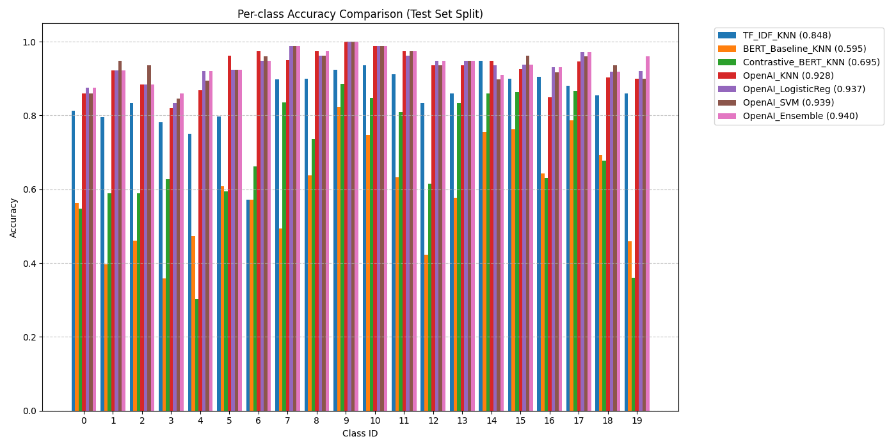

# Contrastive fine-tuning on embedding Transformer models

## Motivation
How to get embeddings that fit your use-case and/or demand?
Sometimes you'd like to use existing class information of the to-be embedded text, which could influence the classification decision on the downstream model (KNN or Logistic regression for example).

This implementation is a Contrastive Learning approach to the classification of the text, where I'm fine-tuning the embedding model. For the sake of the demo data used here is a "The 20 newsgroups text dataset" dataset which comprises of 20 different classses and about 10k+ training examples and about 250 test examples.

The comparison is done by:
- fine-tuning ModernBert model's last layer with contrastive learning (using triplet loss - same class items are clustered to be closer together in the embedding space, while different class embeddings are pushed away from each other)
- comparing it to simple Bert (non-finetuned) embedding -> KNN-Classification
- Another models will be added for comparison as well e.g. AzureOpenAI embeddings + SetFit (similar finetuning with CL)-
- Comparison to other models like AzureOpenAI Embeddings, SimFit approach, \#TODO

## Installation
Required: `python >= 3.12.9`, `uv`
run following:
> `uv sync`

## Experiments
Overall approach:  
Train the contrastive models on the built-in train split, evaluate with baseline (just embedding without Contrastive pre-training) eval split, 80% for populating the KNN index, the rest 20% of the test split on final evaluation.

## Training
Train the model with:  
> `uv run src/train.py`
This saves the checkpoints under the root such as `./contrastive_model_expoch_x.pt`

## Evaluation
For evaluation we're using 20 newsgroups built-in test split, the KNN index is poluated with 80% of the test data, for the rest 20% of the data we're performing the testing, see the results below for the comparison between baseline BERT without CL finetuning (`Baseline`) and CL finetuned embedding projection (`Trained`).

Evaluation between the models is run with:
> `uv run src/evaluate.py --trained_model_path contrastive_model_epoch_3.pt`

**Note here I've used a epoch 3 checkpoint**

## Notes
While implementing this approach I wasn't aware that SetFit existed,, I've had Contrastive-Leanring experience during my intership at Nokia in 2020, but for image space. This is a nice exmaple how the Deep Learning can be applied to many disciplines and some concepts propagate across modalities.